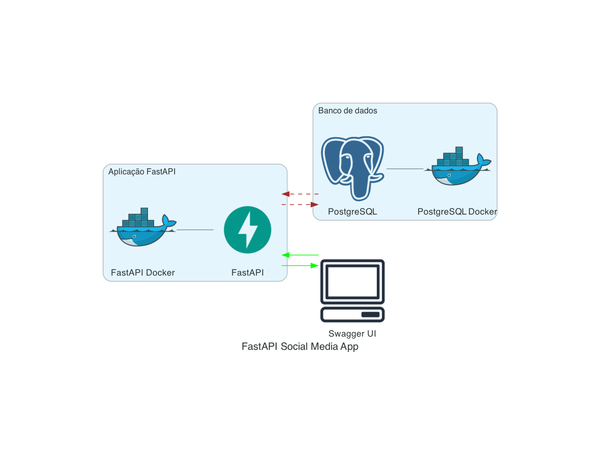

# Aplicativo de Mídia Social com FastAPI

Aplicativo simples de CRUD com Python, utilizando FastAPI para testar funcionalidade de postagens e usuários em uma rede social. As operações incluem criação, leitura, atualização e exclusão de postagens e usuários. 

O projeto também implementa estruturas de roteamento e manipulação de erros, usa SQLAlchemy para operações do banco de dados, e implementa uma estrutura clara de modelos, rotas, e schemas.

## Arquitetura simplificada

A arquitetura do aplicativo é dividida em três partes principais, todas rodando em contêineres Docker separados para fácil escalabilidade e manutenção:

<p align="center">  </p>

`Cliente:` Este é o ponto de entrada para os usuários interagirem com o aplicativo. Eles podem fazer isso através de um navegador web, um cliente REST, ou qualquer outra interface que possa fazer solicitações HTTP.

`Aplicação:` Aqui é onde o aplicativo realmente reside. As solicitações do cliente são recebidas e processadas aqui. É onde ocorre toda a lógica do aplicativo, incluindo a recepção de solicitações, a manipulação de dados e a comunicação com o banco de dados.

`Banco de dados:` Este é o banco de dados do aplicativo, onde todos os dados são armazenados. O aplicativo se comunica com o banco de dados para criar, ler, atualizar e excluir registros conforme necessário.

## Estrutura do Projeto

```bash
/fastapi-social-media-app
    /app
        main.py
        /db
            __init__.py
            base.py
        /models
            __init__.py
            post.py
            user.py
        /schemas
            __init__.py
            post.py
            user.py
        /routes
            __init__.py
            post.py
            user.py
    poetry.lock
    pyproject.toml
    /docs
docker-compose.yml
Dockerfile
README.md
```

* `main.py`: O ponto de entrada para o aplicativo.
* `/db`: Conexão com o banco de dados.
* `/models`: Contém as classes de modelo do banco de dados.
* `/schemas`: Contém os schemas Pydantic para validação de dados.
* `/routes`: Contém os endpoints da API.

## Executando o App com Docker

1. Clone este repositório em sua máquina local.
2. Navegue até a pasta do projeto em um terminal.
3. Execute o comando `docker-compose up`.

O comando acima irá:

* Construir uma imagem Docker para o aplicativo usando o `Dockerfile` na pasta do projeto.
* Iniciar um contêiner Docker usando essa imagem.
* Mapear a porta 8000 dentro do contêiner Docker para a porta 8000 em sua máquina local.
* Montar a pasta do projeto dentro do contêiner Docker, de modo que as alterações feitas na pasta do projeto em sua máquina local sejam refletidas dentro do contêiner.

## Executando o App Localmente

Se você preferir não usar o Docker, pode executar o aplicativo e o banco de dados separadamente.

1. Clone este repositório em sua máquina local.
2. Navegue até a pasta do projeto em um terminal.
3. Inicie um servidor PostgreSQL localmente ou use um serviço de nuvem. Atualize o arquivo `.env` com os detalhes da conexão.
4. Instale as dependências Python no seu ambiente virtual com `poetry install`.
5. Inicie o servidor FastAPI com `uvicorn main:app --reload`.

A opção `--reload` habilita o hot reloading, que aplica automaticamente as alterações que você faz no código fonte sem a necessidade de reiniciar manualmente o servidor.

Você pode acessar o aplicativo navegando para `http://localhost:8000` em seu navegador.

## Variáveis de Ambiente

Usamos um arquivo `.env` para gerenciar as variáveis de ambiente. Este arquivo deve estar na raiz do projeto e conter o seguinte:

```env
POSTGRES_SERVER=<seu_servidor_postgres>
POSTGRES_USER=<seu_usuario_postgres>
POSTGRES_PASSWORD=<sua_senha_postgres>
POSTGRES_DB=<seu_banco_de_dados_postgres>
POSTGRES_PORT=<sua_porta_postgres>
```

Atualize os espaços reservados com os detalhes do seu servidor PostgreSQL.

**Nota:** O arquivo `.env` não está incluído no controle de versão, pois pode conter informações sensíveis. Certifique-se de que `.env` esteja adicionado ao seu arquivo `.gitignore`.

## Como Realizar Operações CRUD usando a FastAPI Docs

Com o aplicativo FastAPI em execução, abra o navegador da web e acesse o seguinte URL:

```bash
http://localhost:8000/docs
```

A aplicação FastAPI Social Media App possui uma documentação abrangente da API que permite interagir com a API e realizar operações CRUD (Criar, Ler, Atualizar, Excluir) nos posts e usuários de forma fácil. Para acessar a documentação da API, siga os passos abaixo:

<p align="center">  </p>

1. **Explorar os Endpoints da API**: Ao acessar o FastAPI Docs, você verá uma interface amigável que exibe todos os endpoints da API disponíveis. O FastAPI Social Media App oferece os seguintes endpoints para os posts e usuários:
    
    * **GET `/posts`**: Obter todos os posts.
        
    * **GET `/posts/{id}`**: Obter um post específico por ID.
        
    * **POST `/posts`**: Criar um novo post.
        
    * **DELETE `/posts/{id}`**: Excluir um post por ID.
        
    * **PUT `/posts/{id}`**: Atualizar um post por ID.
        
    * **GET `/users`**: Obter todos os usuários.
        
    * **GET `/users/{id}`**: Obter um usuário específico por ID.
        
    * **POST `/users`**: Criar um novo usuário.
        
    * **DELETE `/users/{id}`**: Excluir um usuário por ID.
        
    * **PUT `/users/{id}`**: Atualizar um usuário por ID.
        

A documentação da API fornecida pelo FastAPI torna fácil entender e testar as funcionalidades da API sem a necessidade de ferramentas adicionais ou software externo. Divirta-se testando e explorando o FastAPI Social Media App!